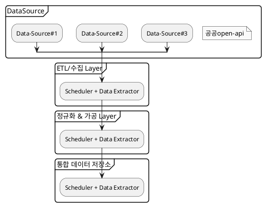

# Medical product meta system
## Background
### Problems
#### 데이터 소스의 분산
* 다양한 기관에서 제공: 식품의약품안전처, 건강보험심사평가원 등 기관별로 데이터가 제공됨.
* 데이터 범위의 중복 또는 불일치: 예를 들어, 제품 허가 정보와 개요 정보가 유사한 데이터를 담고 있으나 표현 방식이나 기준이 상이함.
* 데이터 연결을 위한 식별자 불일치: 공통된 키값(예: 제품코드, 품목기준코드 등)이 있지만, API마다 사용하는 필드명이나 형식이 달라 매핑 과정이 필요함.

#### API 규격의 비일관성
* 요청 방식의 비표준적 행태:
  * 어떤 API는 GET 방식, 어떤 API는 POST 방식 사용.
  * 요청 파라미터 명명 규칙이나 필수 여부가 제각각임.

* ⠀응답 구조의 차이:
  * JSON과 XML이 혼용되거나, JSON 구조가 깊이/포맷 측면에서 서로 다름.
  * 응답 필드명이 영문/한글 혼용되거나, 축약/비축약이 일관되지 않음.

* ⠀페이징 처리 미지원 또는 상이:
  * 일부 API는 페이징 처리가 되어 있지 않거나, 페이지 번호와 페이지 크기 설정 방식이 달라 일괄 수집 시 어려움 발생.

* ⠀문서화 부족 및 표준 미준수:
  * Swagger 등 표준 문서 포맷 미지원으로 자동화된 연동 개발이 어려움.
  * 예외 상황에 대한 응답 정의가 부족하여 오류 처리 곤란.

### Improvements
#### 데이터 수집 및 정규화
* ETL(Extract-Transform-Load) 파이프라인 구축
  * 다양한 출처의 데이터를 자동으로 수집 (API 호출, 정기 크롤링 등)
  * 공통 식별자(예: 품목기준코드, 제품코드 등) 기반으로 데이터를 정규화 및 매핑
  * 누락/중복 제거, 일관된 필드 구조로 가공
* 데이터 정합성 확보
  * 상이한 단위, 명칭, 날짜 형식 등을 표준화
  * 동일 개념에 대해 공통된 키워드/명칭 사용 (예: "허가일자" → approvalDate)
#### 중앙 통합 저장소 구축
* 데이터 웨어하우스 또는 관계형 DB 사용
  * MySQL/PostgreSQL, 혹은 확장성을 고려한 BigQuery, Redshift 등
  * 테이블 구조는 주요 기준 코드(품목기준코드 등)를 기준으로 정규화된 형태 설계
  * 데이터 최신 상태를 유지하기 위한 버전 관리 또는 updatedAt 필드 운영
* 데이터 메타 관리 체계
  * 데이터 출처, 갱신일, 기관명, 갱신 주기 등의 메타데이터 관리
#### 표준화된 API 제공
* **스케줄링 시스템 구성 (예: Airflow, Cron + Node/Script)**
  * 기관별 API 호출 주기 조정 가능 (예: 식약처는 하루 1회, 심평원은 주 1회 등)
  * 장애 시 재시도 또는 알림 발송
* 모니터링 및 로깅
  * 수집 실패, 응답 이상, API 실패율 등을 로그로 남기고 대시보드 구성
  * 슬랙/이메일 알림 연동 가능

## 통합 아키텍처 구성 예시
### Basic


### Producer/consumer (using Kafka)


#### 예상 토픽
| Topic                  | 용도        | 메시지 생산자 | 메시지 소비자               |
|------------------------|-----------|---------|-----------------------|
| product.raw.drug       | API 수집 결과 | 수집기     | 정규화기                  |
| product.raw.supplement | API 수집 결과 | 수집기     | 정규화기                  |
| product.normalized     | 정규화 데이터   | 정규화기    | 저장기                   |
| product.meta.updated   | 변경 감지     | 정규화기    | 감시 시스템, 인덱서, 알림 시스템 등 |
#### Partition 및 Batch 전략
| 항목               | 설명                                                           | 기타                                                           |
|------------------|--------------------------------------------------------------|--------------------------------------------------------------|
| Partition Key 기준 | product_id.hashCode() % partition_size로 라운드로빈 분산             |                                                              |
| Producer         | acks=1<br>batch.size=100<br>linger.ms=100<br>compression.type=lz4 | `batch.size`=100은 페이징 단위에 맞춤<br>`linger.ms`=100~500은 소량 쌓이더라도 일정 시간 후 전송 |

## 데이터 갱신 전략
### Delta 방식
**Delta 방식**은 **변경된 데이터만 탐지하여 갱신**하는 방식이며, 전체 데이터를 반복 다운로드하는 Full Load 방식에 비해 **트래픽 감소**, **속도 향상**, **API 부하 감소** 등의 장점이 있음

#### 구현 방안
| 전략 항목        | 설명                                                           |
|--------------|--------------------------------------------------------------|
| 기준 필드        | 각 데이터 소스에서 제공하는 `갱신일자`, `수정일자`혹은 `등록일자`필드를 기준으로 비교<br>       |
| 최종 동기화 시점 저장 | 테이블 또는 로그에 각 데이터 소스별로 마지막 가져온 일자 저장. (`last_synced_at`)      |
| ETL 스케줄러     | 주기적으로 `last_synced_at` 이후의 데이터만 가져오도록 API 호출 시점 조정           |
| 신규/수정 분리 처리  | 응답 데이터의 상태(신규, 수정, 삭제)를 명시해주면 구분 가능. 제공되지 않을 경우 해시/버전 비교 방식 도입 |
| 삭제 처리 방식     | API에서 삭제 여부 제공 시 soft delete 적용, 그렇지 않으면 주기적 full load로 누락 확인 병행 필요 |

### 데이터에 대한 메타 정보 API 설계
#### 주요 메타 정보 항목
| 필드              | 설명                        |
|-----------------|---------------------------|
| source          | 데이터 출처 기관 (예: MFDS, HIRA) |
| lastUpdated     | 마지막 갱신 시각                 |
| recordCount     | 총 데이터 건수                  |
| refreshInterval | 갱신 주기 (ex. 1일, 7일 등)      |
| schemaVersion   | 스키마 버전 정보                 |
| status          | 현재 수집 상태 (정상, 지연, 오류 등)   |

## 데이터 타입별 분리 전략
각 제품 타입별로 별도 테이블 관리하여 스키마의 명확성, 상대적으로 용이한 제약조건의 설정 및 도메인 모델의 분리가 가능하도록 하며, 현재 예상 가능한 제품 타입은 의약품, 의약외품, 건강보조 식품 등이 있음. 단 각 타입별 제품의 중복된 속성을 제거하기 위해 다음과 같은 하이브리드 전략을 사용.

#### 구조
* 기본 혹은 공통된 정보는 통합 테이블에 저장 및 관리 
* 타입별 상세정보는 서브 테이블로 저장 및 관리
#### 

## Data sources
### Open APIs

* 건강보험심사평가원_의약품사용정보조회서비스
  * [건강보험심사평가원_의약품사용정보조회서비스](https://www.data.go.kr/data/15047819/openapi.do) 
* 식품의약품안전처_의약품개요정보(e약은요)
  * [식품의약품안전처_의약품개요정보\(e약은요\)](https://www.data.go.kr/data/15075057/openapi.do#tab_layer_recommend_data) 
  * 사용 필요가 없을 것으로 보임
* 식품의약품안전처_의약품 제품 허가정보
  * [식품의약품안전처_의약품 제품 허가정보](https://www.data.go.kr/data/15095677/openapi.do) 
* 건강보험심사평가원_의약품성분약효정보조회서비스
  * [건강보험심사평가원_의약품성분약효정보조회서비스](https://www.data.go.kr/data/15021027/openapi.do#tab_layer_detail_function) 
* [식품의약품안전처_의약품 품목 유효기간 정보](https://www.data.go.kr/data/15111775/openapi.do)
* [인공지능 개발을 위한 알약 이미지 데이터]([약학정보원](https://www.health.kr/notice/notice_view.asp?show_idx=1001&search_value=&search_term=&paging_value=&setLine=&setCategory))
* [건강보험심사평가원_약가기준정보조회서비스](https://www.data.go.kr/data/15054445/openapi.do#/API%20%EB%AA%A9%EB%A1%9D/getDgamtList)
  * 제품명으로 조회해야 함.
## Data source details
### fetch list of medical products
#### URL
* https://www.data.go.kr/data/15095677/openapi.do#/API%20%EB%AA%A9%EB%A1%9D/getDrugPrdtPrmsnInq06
#### Constraints
* max request size(numOfRows): 100
#### Fetching sample
```shell
curl -X 'GET' \
  'https://apis.data.go.kr/1471000/DrugPrdtPrmsnInfoService06/getDrugPrdtPrmsnInq06?serviceKey=mf%2Fad0132hYGXI2kLeBAJ7ml%2BDdVw2EHtFNIk6%2FsuAJZSAkj4ZyJON%2FYMHJuzC4Vvo9Q%2BQaJFIim3yx2Q4nwPA%3D%3D&pageNo=1&numOfRows=100&type=json' \
  -H 'accept: */*'
```

### fetch details of a medical product
#### URL
* https://www.data.go.kr/data/15095677/openapi.do#/API%20%EB%AA%A9%EB%A1%9D/getDrugPrdtPrmsnDtlInq05
#### Constraints
* max request size(numOfRows): 100
  * but need to fetch using “품목기준코드(item_seq)”, which is given in the list

#### Fetching sample
```shell
curl -X 'GET' \
  'https://apis.data.go.kr/1471000/DrugPrdtPrmsnInfoService06/getDrugPrdtPrmsnDtlInq05?serviceKey=mf%2Fad0132hYGXI2kLeBAJ7ml%2BDdVw2EHtFNIk6%2FsuAJZSAkj4ZyJON%2FYMHJuzC4Vvo9Q%2BQaJFIim3yx2Q4nwPA%3D%3D&pageNo=1&numOfRows=100&type=json&item_seq=195500005' \
H 'accept: */*'
```


```shell
curl -X 'GET' \
'http://apis.data.go.kr/B551182/codeInfoService/getAddrCodeList?serviceKey=mf%2Fad0132hYGXI2kLeBAJ7ml%2BDdVw2EHtFNIk6%2FsuAJZSAkj4ZyJON%2FYMHJuzC4Vvo9Q%2BQaJFIim3yx2Q4nwPA%3D%3D&type=json' \
-H 'accept: */*'
```


## Resources
### Diagrams
#### Basic process



#### Using Kafka process
```
@startuml

!include <cloudinsight/kafka>


rectangle "dataSource" as dataSource
rectangle "ETL_CollectorProcess" as ETL_Collector
rectangle "DataNormalizerProcess" as DataNormalizer
rectangle "DataPersistenceProcess" as DataPersistencer

queue "<$kafka>raw_data" as kafka_raw_data
queue "<$kafka>normalized_data" as kafka_normalized_data
database "DataBase" as DataBase

dataSource -> ETL_Collector

ETL_Collector -> kafka_raw_data
kafka_raw_data -> DataNormalizer
DataNormalizer --> kafka_normalized_data
kafka_normalized_data --> DataPersistencer
DataPersistencer --> DataBase
@enduml

```
