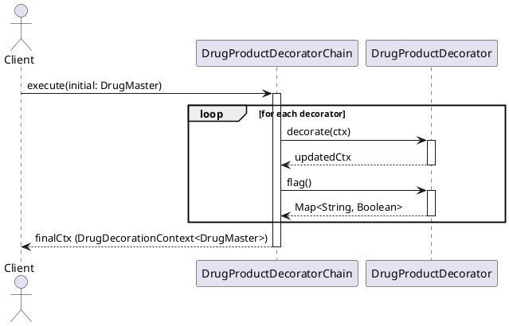

## flows
### drug master decorator flow

## Resources
### drug master decorator flow plantuml

```plantuml
@startuml
actor Client

Client -> DrugProductDecoratorChain : execute(initial: DrugMaster)

activate DrugProductDecoratorChain

loop for each decorator
    DrugProductDecoratorChain -> DrugProductDecorator : decorate(ctx)
    activate DrugProductDecorator
    DrugProductDecorator --> DrugProductDecoratorChain : updatedCtx
    deactivate DrugProductDecorator

    DrugProductDecoratorChain -> DrugProductDecorator : flag()
    activate DrugProductDecorator
    DrugProductDecorator --> DrugProductDecoratorChain : Map<String, Boolean>
    deactivate DrugProductDecorator

end

DrugProductDecoratorChain --> Client : finalCtx (DrugDecorationContext<DrugMaster>)

deactivate DrugProductDecoratorChain
@enduml

```
